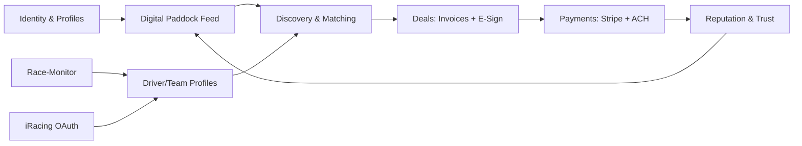

# Renegade Race Rentals — Long-Term Roadmap

_Last updated: May 3, 2026_

## Product vision

A "digital paddock" where motorsports professionals (drivers, teams, coaches, crew, vehicle owners, sponsors) discover each other, talk, agree, and pay — all in one place. Rentals and coaching become _features_ inside the social platform, not the platform itself.

The existing monorepo already has the marketplace, messaging, profiles, teams, applications, endorsements, Stripe Connect, and a coach product live. This roadmap treats that as the foundation and layers the social + integrations + monetization vision on top.

## Assumptions

- Solo developer, full-time, AI-assisted (Cursor/agents do most implementation) — timeline assumes ~1.5–2x velocity of a solo full-time human.
- Hybrid payments: keep Stripe Connect for cards, add ACH for high-value transfers (invoices, deposits) to reduce fees without taking on money-transmitter compliance.
- Start date: **May 5, 2026**. End-of-Q4 2026 target for v1.0 public.

## Phase summary

| Phase | Window | Theme |
|------:|--------|-------|
| 0 | May 5 → May 18, 2026 | Brand & infra prep |
| 1 | May 19 → June 29, 2026 | Digital Paddock MVP (feed, profiles, invoices, e-sign) |
| 2 | June 30 → July 27, 2026 | Race data integrations (race-monitor, iRacing) |
| 3 | July 28 → Aug 17, 2026 | Monetization (subs, featured, ACH) |
| 4 | Aug 18 → Sept 14, 2026 | Public beta + growth loops |
| 5 | Sept 15 → Dec 31, 2026 | Mobile + scale |

---

## Phase 0 — Brand & infra prep (2 weeks): May 5 → May 18, 2026

**Goal:** Reposition the product surface area and prepare infra for the social pivot.

- Rebrand the web app from "Renegade Rentals" → "Renegade Race Rentals / The Paddock" in [`apps/web/README.md`](../apps/web/README.md), marketing pages, and [`apps/web/app/layout.tsx`](../apps/web/app/layout.tsx).
- Restructure top-nav IA: `Paddock` (feed/social), `People` (drivers/teams/coaches), `Garage` (vehicles), `Coaching`, `Deals` (invoices, contracts).
- Add `posts` and `follows` table stubs in [`packages/backend/convex/schema.ts`](../packages/backend/convex/schema.ts) so feed work can begin in Phase 1 without schema churn.
- Spike race-monitor API access (sign-up takes days; $100/mo entry tier) and submit iRacing OAuth client registration (10 business day lead time — start now so it's ready by Phase 2).

**Checkpoint — May 18:** branded shell deployed; race-monitor + iRacing credentials in flight.

---

## Phase 1 — Digital Paddock MVP (6 weeks): May 19 → June 29, 2026

**Goal:** Make the platform feel social, and ship the two must-have deal primitives (custom invoices + e-sign).

### 1a. The Paddock feed (~2 weeks, May 19 → June 1)

- New tables in [`packages/backend/convex/schema.ts`](../packages/backend/convex/schema.ts): `posts`, `postReactions`, `postComments`, `follows`, `activity` (system-generated events: "X joined Team Y", "Z posted lap time at COTA").
- New routes: `apps/web/app/paddock/page.tsx` (home feed), `apps/web/app/paddock/[postId]/page.tsx`.
- Reuse existing [`packages/backend/convex/presence.ts`](../packages/backend/convex/presence.ts) to power "online now" rails on profiles and the feed.
- Surface existing data into the feed: new endorsements, accepted team applications, team events, new coach listings — using the existing `notifications` plumbing as the source.

### 1b. Profile depth + interaction (~1 week, June 2 → June 8)

- Extend `driverProfiles` with `coverImageR2Key`, `pronouns`, `careerHighlights`, `helmetDesignR2Key`, `videoReelUrl`.
- Extend `teams` with `coverImageR2Key`, `foundedYear`, `principal`, `sponsors`.
- Add a "Follow" CTA on `apps/web/app/motorsports/drivers/[id]/` and `apps/web/app/motorsports/teams/[id]/`.
- Wire a DM CTA to existing `conversations` (already supports `driver` and `team` types).

### 1c. Custom invoice generation (~1.5 weeks, June 9 → June 19)

- Today there are two purpose-built invoice tables: `coachInvoices` and `damageInvoices` in [`packages/backend/convex/schema.ts`](../packages/backend/convex/schema.ts). Replace with a unified `invoices` table that supports any sender → recipient with line items:
  - `senderId`, `recipientId`, `lineItems[]`, `subtotal`, `tax`, `total`, `dueDate`, `status`, `paymentMethod` (`stripe_card` | `stripe_ach` | `external`), `attachments[]`, `relatedEntity` (rental/coaching/team-contract).
- Migrate `coachInvoices` and `damageInvoices` data into `invoices` with backfill scripts (Convex internal mutations); keep old tables read-only for one release for safety.
- New routes: `apps/web/app/deals/invoices/`, `apps/web/app/deals/invoices/[id]/`, `apps/web/app/deals/invoices/new/`.
- PDF rendering with `@react-pdf/renderer` for downloads + email attachments (Resend already wired).

### 1d. E-signable documents (~1.5 weeks, June 20 → June 29)

- Use **Documenso** (open-source, self-host or hosted, ~$30/mo) for v1 — keeps signature data on infrastructure we control. Fallback: Dropbox Sign API.
- New tables: `documents` (template + instance), `documentSignatures` (signer, status, timestamp, IP, signatureImageR2Key).
- Templates seeded for: rental agreement, coaching agreement, driver-team contract, NDA, sponsorship MoU.
- Integrate signing flow into invoice and team application screens: when a team accepts a driver application, optionally attach a contract to sign.

**Checkpoint — June 29:** Paddock feed live, follows working, custom invoices replacing legacy invoice tables, e-sign working on the rental + driver-team contract flows.

---

## Phase 2 — Race data integrations (4 weeks): June 30 → July 27, 2026

**Goal:** Make profiles credible and discoverable by surfacing real performance data.

### 2a. race-monitor integration (~2 weeks, June 30 → July 13)

- New Convex action `packages/backend/convex/raceMonitor.ts` calling `api.race-monitor.com`.
- New tables: `raceEvents`, `raceResults` (driver-claimed + verified), `lapTimes`.
- Driver/team profile claim flow: enter race-monitor competitor ID; results auto-link.
- Cron in [`packages/backend/convex/crons.ts`](../packages/backend/convex/crons.ts) to backfill new results daily.
- Surface "Recent Results" + "Personal best at this track" on driver and team profile pages.

### 2b. iRacing integration (~2 weeks, July 14 → July 27)

- iRacing OAuth2 PKCE flow (browser-based) — OAuth client registered back in Phase 0 should be available by now.
- Convex HTTP route in [`packages/backend/convex/http.ts`](../packages/backend/convex/http.ts) for the OAuth callback; store refresh token encrypted.
- Sync iRating, Safety Rating, license class, recent series participation per driver.
- Show on driver profile + use as a discovery filter in [`apps/web/app/motorsports/drivers/page.tsx`](../apps/web/app/motorsports/drivers/page.tsx) (e.g. "min iRating 2500").
- Sim/real toggle on profile so iRacing data is gracefully optional.

**Checkpoint — July 27:** drivers can connect iRacing accounts; race-monitor results show on at least 50 seeded driver profiles.

---

## Phase 3 — Monetization (3 weeks): July 28 → Aug 17, 2026

**Goal:** Multiple revenue streams live; ACH option for big-ticket payments.

- **Subscriptions** via Stripe Billing: Driver Pro ($9/mo), Team Pro ($29/mo), Team Elite ($99/mo). Gate features like featured profile placement, advanced analytics, unlimited document templates, race-data backfill depth.
- **Marketplace fees** already at 5% in [`packages/backend/convex/stripe.ts`](../packages/backend/convex/stripe.ts) — extend to coach bookings + invoice payments via the platform.
- **Featured listings**: paid boost for drivers/teams/coaches/vehicles in `apps/web/app/paddock/` and search results.
- **Hybrid ACH**: add Stripe ACH (`us_bank_account`) as a payment method on invoices over $500. Stripe ACH caps at $5 (vs ~$15-30 on cards for the same invoice). New webhook handlers in [`packages/backend/convex/stripe.ts`](../packages/backend/convex/stripe.ts) for `payment_intent.processing` (ACH 1-3 day settlement).
- **Decision gate:** if monthly invoice GMV > $50k by end of Phase 3, prototype **Increase** or **Dwolla** as a true Stripe alternative for ACH-only flows in Phase 5.

**Checkpoint — Aug 17:** first $1 of subscription revenue + ACH invoice payment land in production.

---

## Phase 4 — Public beta + growth loops (4 weeks): Aug 18 → Sept 14, 2026

**Goal:** Open the doors, instrument growth, harden trust.

- Verified badges (race-monitor + iRacing + manual ID checks).
- Referrals / invites with rev-share for power users.
- Sponsor / brand profiles (separate user type).
- SEO surfaces: per-track results pages, per-series leaderboards (race-monitor data is gold here).
- PostHog or Convex analytics dashboards for funnels (sign-up → first follow → first DM → first deal).
- Trust & safety: extend existing [`packages/backend/convex/reports.ts`](../packages/backend/convex/reports.ts) and [`packages/backend/convex/userBlocks.ts`](../packages/backend/convex/userBlocks.ts) to cover posts and comments.

**Checkpoint — Sept 14:** public launch; 500+ active accounts target.

---

## Phase 5 — Mobile + scale (Q4 2026): Sept 15 → Dec 31, 2026

**Goal:** Native experience and operational maturity.

- Expo / React Native app sharing Convex types from [`packages/backend/index.ts`](../packages/backend/index.ts).
- Push notifications via Expo Push + existing notification system.
- ACH-direct via Increase or Dwolla (decision from Phase 3 gate).
- Internationalization scaffolding (Europe motorsport market is big).
- Performance pass: Convex query optimization, image CDN audit (R2 + ImageKit already in place).

**Checkpoint — Dec 31, 2026:** v1.0 launched, mobile beta in TestFlight / Play Internal.

---

## Monetization options (full menu)

Recommended starter mix is bolded — already baked into Phase 3.

- **Subscriptions (recurring, predictable)** — Driver Pro $9/mo, Team Pro $29/mo, Team Elite $99/mo. Gates featured placement, deeper race-data history, unlimited e-sign templates, custom invoice branding, advanced analytics.
- **Marketplace transaction fees (already live at 5%)** — extend to all flows: rentals, coaching, custom invoices, driver-team contract signing.
- **Featured listings / boosts** — $5-25 one-shot to surface a driver/team/vehicle in the Paddock feed for 7 days.
- **Custom invoice fee** — 1-2% on invoices paid through the platform (small enough that even non-subscribers use it).
- **E-signature add-on** — free up to N docs/month; Pro tier removes cap.
- Lead-gen for elite drivers — teams pay to message top-rated drivers (LinkedIn-style InMail).
- Sponsored content — track promoters, tire / parts manufacturers buy native posts.
- Data licensing (long-term) — anonymized aggregate race performance to teams, broadcasters, betting markets.
- Verified badge — paid (or KYC-funded) verification for serious accounts.

### Internal bank transfers — assessment

Choice: **hybrid**. Cost ladder for a $1,000 invoice:

| Rail | Fee | Owner nets |
|------|-----|-----------:|
| Stripe card | ~$29.30 (2.9% + $0.30) | $970.70 |
| Stripe ACH | $5 cap (0.8%) — **Phase 3 ships this** | $995.00 |
| Increase / Dwolla ACH | ~$0.25–0.50 — **Phase 5 evaluation** | $999.50 |
| Closed-loop wallet (peer-to-peer balances) | ~$0 per transfer | $1,000.00 |

The closed-loop wallet looks free, but it triggers state-by-state money-transmitter licensing (~$500k+ in legal/compliance setup, 12-18 months). Not worth it pre-PMF.

The hybrid path captures ~80% of the savings of going non-Stripe with ~5% of the work and zero new compliance burden.

---

## Risks and contingencies

- **iRacing OAuth approval can slip** — start application Phase 0 day 1; if not approved by Phase 2, ship race-monitor first, iRacing a sprint later.
- **race-monitor data coverage** is event-by-event — many club races aren't on it. Add manual result entry as fallback (admin-moderated).
- **Documenso self-host pain** — fallback to Dropbox Sign hosted API; ~$25/user/mo, costs more but eliminates infra.
- **Stripe ACH 1-3 day settlement** breaks the existing "instant rental confirm" UX — only enable on invoices, not rental checkout, for now.

## Out of scope this year

- Live timing during a race (different architecture; revisit 2027).
- Telemetry data (MoTeC / AiM) — possible Phase 5+ stretch.
- DAO / token / blockchain anything.
- Insurance underwriting (partnership only, not an internal product).
